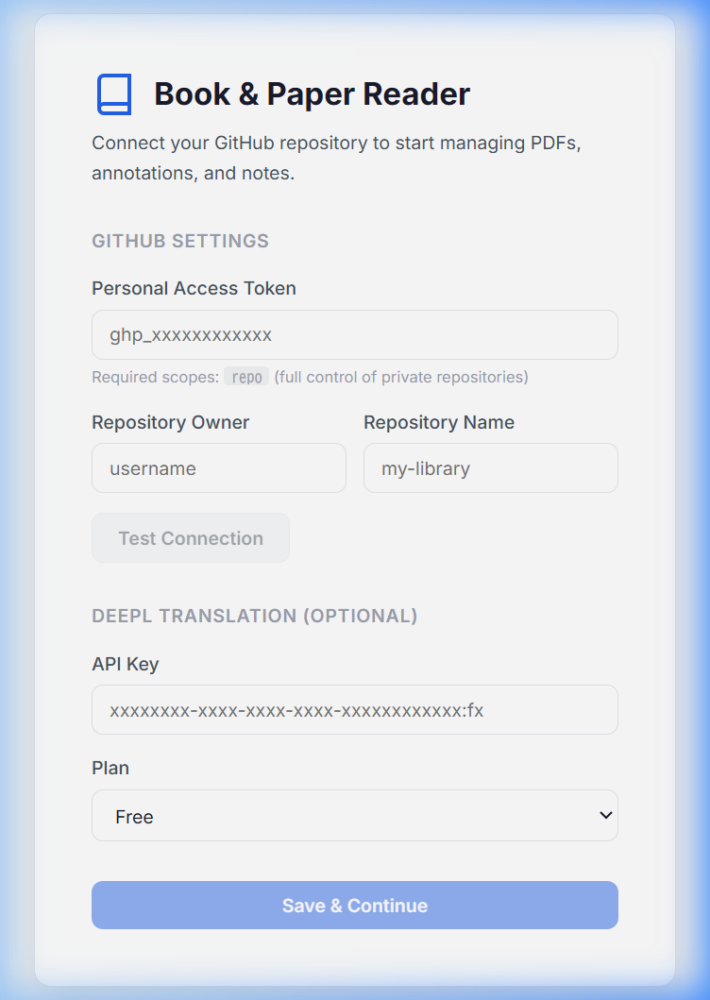

# Book & Paper Reader

A browser-based PDF literature management tool powered by GitHub as a backend. Read, annotate, translate, and take notes on academic papers and books — all in one place.



## Features

- 📖 **PDF Reader** — Render PDFs with zoom, scroll, and text selection (pdf.js)
- 🖍️ **Annotations** — Highlight text in 5 colors (yellow, green, blue, pink, orange) with burn-in to PDF
- 🌐 **DeepL Translation** — Select text and get instant translation via tooltip
- 📝 **Markdown Memo** — CodeMirror 6 editor with syntax highlighting and auto-save
- 📁 **File Tree** — Browse your `library/` folder by category
- ☁️ **GitHub Sync** — All data (PDFs, annotations, memos) stored in your own GitHub repo
- ⌨️ **Ctrl+S** — Save annotations + PDF to GitHub in one commit

## Tech Stack

| Category | Technology |
|----------|-----------|
| Framework | React 18 + Vite |
| State | Zustand |
| PDF Render | pdfjs-dist |
| PDF Edit | pdf-lib |
| Markdown | CodeMirror 6 |
| Translation | DeepL API |
| GitHub | @octokit/rest |

## Getting Started

```bash
# Install dependencies
npm install

# Start dev server
npm run dev
```

Open `http://localhost:5173` and configure:
1. **GitHub Personal Access Token** (with `repo` scope) — [Get one here](https://github.com/settings/tokens/new)
2. **Repository** owner and name (e.g., `my-library`)
3. **DeepL API Key** (optional) — [Get one here](https://www.deepl.com/pro#developer)

## Repository Structure (Data)

Your GitHub data repository should follow this structure:

```
my-library/
├── library/
│   ├── Papers/
│   │   └── Example_Paper/
│   │       ├── document.pdf
│   │       ├── memo.md
│   │       ├── metadata.json
│   │       └── annotations.json
│   └── Books/
│       └── ...
```

## License

MIT
